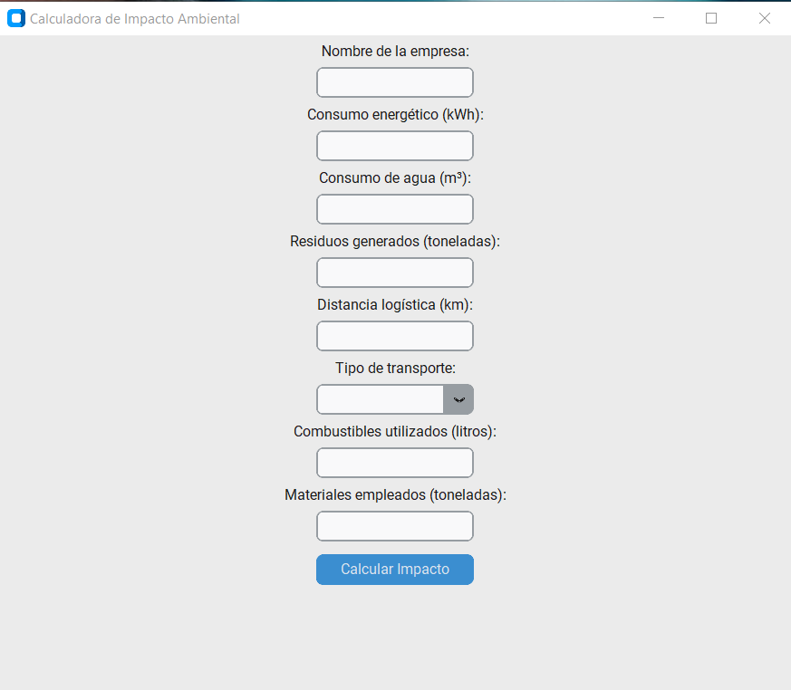
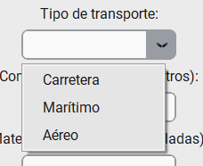

# Guía para ejecutar el software

1. Requisitos previos
Antes de ejecutar el programa, asegúrate de tener instalado:
✅ Python (versión 3.8 o superior).
✅ Las siguientes librerías de Python (puedes instalarlas con pip):

         pip install matplotlib numpy customtkinter reportlab

2. Descargar o copiar el código

Guarda el código en un archivo llamado calculadora.py.

3. Ejecutar el programa

Abre una terminal o símbolo del sistema en la carpeta donde guardaste el archivo y ejecuta:

         python calculadora_impacto.py

4. Uso de la interfaz gráfica

1️⃣ Se abrirá una ventana donde deberás ingresar los datos de la empresa (energía, agua, residuos, etc.).

2️⃣ Selecciona el tipo de transporte en la lista desplegable.

3️⃣ Haz clic en el botón "Calcular Impacto".

5. Resultados generados
📌 Se mostrará un mensaje de confirmación.
📌 Se generará un gráfico de impacto y un reporte en PDF con los datos y recomendaciones.

[reporte_empresa.pdf](../output/reporte_empresa.pdf)

[grafico_impacto.png](../output/grafico_impacto.png)

📌 Los archivos se guardarán en la carpeta output/:

[output](../output)

📄 output/reporte_empresa.pdf → Informe con resultados y sugerencias.
📊 output/grafico_impacto.png → Gráfico del impacto ambiental.

